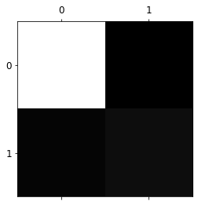

```python
# 파이썬 ≥3.5 필수
import sys
assert sys.version_info >= (3, 5)

# 사이킷런 ≥0.20 필수
import sklearn
assert sklearn.__version__ >= "0.20"

# 공통 모듈 임포트
import numpy as np
import os

# 노트북 실행 결과를 동일하게 유지하기 위해
np.random.seed(42)

# 깔끔한 그래프 출력을 위해
%matplotlib inline
import matplotlib as mpl
import matplotlib.pyplot as plt
mpl.rc('axes', labelsize=14)
mpl.rc('xtick', labelsize=12)
mpl.rc('ytick', labelsize=12)

# 그림을 저장할 위치
PROJECT_ROOT_DIR = "."
CHAPTER_ID = "classification"
IMAGES_PATH = os.path.join(PROJECT_ROOT_DIR, "images", CHAPTER_ID)
os.makedirs(IMAGES_PATH, exist_ok=True)

def save_fig(fig_id, tight_layout=True, fig_extension="png", resolution=300):
    path = os.path.join(IMAGES_PATH, fig_id + "." + fig_extension)
    print("그림 저장:", fig_id)
    if tight_layout:
        plt.tight_layout()
    plt.savefig(path, format=fig_extension, dpi=resolution)
```


```python
from sklearn.datasets import fetch_openml
mnist = fetch_openml('mnist_784', version=1)
mnist.keys()
```


    dict_keys(['data', 'target', 'frame', 'categories', 'feature_names', 'target_names', 'DESCR', 'details', 'url'])


```python
mnist.keys()
```


    dict_keys(['data', 'target', 'frame', 'categories', 'feature_names', 'target_names', 'DESCR', 'details', 'url'])


```python
X,y=mnist["data"],mnist["target"]
X.shape
```


    (70000, 784)


```python
y.shape
```


    (70000,)


```python
import matplotlib as mpl
import matplotlib.pyplot as plt

some_digit=X[10] #3 출력
some_digit_image=some_digit.reshape(28,28)

plt.imshow(some_digit_image,cmap="binary")
plt.axis("off")
plt.show()
```


    

    


```python
y[10]
```


    '3'


```python
y=y.astype(np.uint8)

```


```python
y
```


    array([5, 0, 4, ..., 4, 5, 6], dtype=uint8)


```python
X_train, X_test, y_train, y_test = X[:60000], X[60000:], y[:60000], y[60000:]
```


```python
#이진 분류

y_train_5=(y_train ==5)
y_test_5=(y_test ==5)
```


```python
y_train_5
```


    array([ True, False, False, ...,  True, False, False])


```python
from sklearn.linear_model import SGDClassifier

sgd_clf = SGDClassifier(random_state=42)
sgd_clf.fit(X_train, y_train_5)

sgd_clf.predict([some_digit]) #some_digit이 3이므로 False 나올 것
```


    array([False])


```python
from sklearn.model_selection import cross_val_score

cross_val_score(sgd_clf, X_train, y_train_5, cv=3, scoring="accuracy")
```


    array([0.95035, 0.96035, 0.9604 ])


```python
from sklearn.model_selection import cross_val_predict

y_train_pred=cross_val_predict(sgd_clf,X_train,y_train_5,cv=3)

from sklearn.metrics import confusion_matrix
conf_mx=confusion_matrix(y_train_5,y_train_pred)

```


```python
plt.matshow(conf_mx,cmap=plt.cm.gray)
plt.show()
```


    

    


```python
y_scores=sgd_clf.decision_function([some_digit])
y_scores
```


    array([-5711.47789687])


```python
threshold=0 #임계값
y_some_digit_pred=(y_scores>threshold)

y_some_digit_pred
```


    array([False])


```python
threshold=8000
y_some_digit_pred=(y_scores>threshold)

y_some_digit_pred
```


    array([False])


```python
y_scores=cross_val_predict(sgd_clf,X_train,y_train_5,cv=3,method="decision_function")

y_scores
```


    array([  1200.93051237, -26883.79202424, -33072.03475406, ...,
            13272.12718981,  -7258.47203373, -16877.50840447])


```python
from sklearn.metrics import roc_curve

precisions,recalls, thresholds = roc_curve(y_train_5, y_scores)
```


```python
from sklearn.preprocessing import StandardScaler
scaler = StandardScaler()
X_train_scaled = scaler.fit_transform(X_train.astype(np.float64))
cross_val_score(sgd_clf, X_train_scaled, y_train, cv=3, scoring="accuracy")
```


    array([0.8983, 0.891 , 0.9018])


```python
X_train_scaled 
```


    array([[0., 0., 0., ..., 0., 0., 0.],
           [0., 0., 0., ..., 0., 0., 0.],
           [0., 0., 0., ..., 0., 0., 0.],
           ...,
           [0., 0., 0., ..., 0., 0., 0.],
           [0., 0., 0., ..., 0., 0., 0.],
           [0., 0., 0., ..., 0., 0., 0.]])


