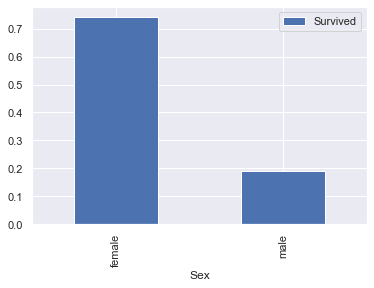

```python
import pandas as pd
import os
import matplotlib.pyplot as plt
%matplotlib inline
import seaborn as sns
sns.set()
import numpy as np

```


```python
train = pd.read_csv("train.csv")
test = pd.read_csv("test.csv")
```


```python
train.head(5)
```


<div>
<style scoped>
    .dataframe tbody tr th:only-of-type {
        vertical-align: middle;
    }

    .dataframe tbody tr th {
        vertical-align: top;
    }

    .dataframe thead th {
        text-align: right;
    }
</style>
<table border="1" class="dataframe">
  <thead>
    <tr style="text-align: right;">
      <th></th>
      <th>PassengerId</th>
      <th>Survived</th>
      <th>Pclass</th>
      <th>Name</th>
      <th>Sex</th>
      <th>Age</th>
      <th>SibSp</th>
      <th>Parch</th>
      <th>Ticket</th>
      <th>Fare</th>
      <th>Cabin</th>
      <th>Embarked</th>
    </tr>
  </thead>
  <tbody>
    <tr>
      <th>0</th>
      <td>1</td>
      <td>0</td>
      <td>3</td>
      <td>Braund, Mr. Owen Harris</td>
      <td>male</td>
      <td>22.0</td>
      <td>1</td>
      <td>0</td>
      <td>A/5 21171</td>
      <td>7.2500</td>
      <td>NaN</td>
      <td>S</td>
    </tr>
    <tr>
      <th>1</th>
      <td>2</td>
      <td>1</td>
      <td>1</td>
      <td>Cumings, Mrs. John Bradley (Florence Briggs Th...</td>
      <td>female</td>
      <td>38.0</td>
      <td>1</td>
      <td>0</td>
      <td>PC 17599</td>
      <td>71.2833</td>
      <td>C85</td>
      <td>C</td>
    </tr>
    <tr>
      <th>2</th>
      <td>3</td>
      <td>1</td>
      <td>3</td>
      <td>Heikkinen, Miss. Laina</td>
      <td>female</td>
      <td>26.0</td>
      <td>0</td>
      <td>0</td>
      <td>STON/O2. 3101282</td>
      <td>7.9250</td>
      <td>NaN</td>
      <td>S</td>
    </tr>
    <tr>
      <th>3</th>
      <td>4</td>
      <td>1</td>
      <td>1</td>
      <td>Futrelle, Mrs. Jacques Heath (Lily May Peel)</td>
      <td>female</td>
      <td>35.0</td>
      <td>1</td>
      <td>0</td>
      <td>113803</td>
      <td>53.1000</td>
      <td>C123</td>
      <td>S</td>
    </tr>
    <tr>
      <th>4</th>
      <td>5</td>
      <td>0</td>
      <td>3</td>
      <td>Allen, Mr. William Henry</td>
      <td>male</td>
      <td>35.0</td>
      <td>0</td>
      <td>0</td>
      <td>373450</td>
      <td>8.0500</td>
      <td>NaN</td>
      <td>S</td>
    </tr>
  </tbody>
</table>
</div>


```python
train.info()
```

    <class 'pandas.core.frame.DataFrame'>
    RangeIndex: 891 entries, 0 to 890
    Data columns (total 12 columns):
     #   Column       Non-Null Count  Dtype  
    ---  ------       --------------  -----  
     0   PassengerId  891 non-null    int64  
     1   Survived     891 non-null    int64  
     2   Pclass       891 non-null    int64  
     3   Name         891 non-null    object 
     4   Sex          891 non-null    object 
     5   Age          714 non-null    float64
     6   SibSp        891 non-null    int64  
     7   Parch        891 non-null    int64  
     8   Ticket       891 non-null    object 
     9   Fare         891 non-null    float64
     10  Cabin        204 non-null    object 
     11  Embarked     889 non-null    object 
    dtypes: float64(2), int64(5), object(5)
    memory usage: 83.7+ KB
    


```python
test.info() #열이 1개 적음(survived)
```

    <class 'pandas.core.frame.DataFrame'>
    RangeIndex: 418 entries, 0 to 417
    Data columns (total 11 columns):
     #   Column       Non-Null Count  Dtype  
    ---  ------       --------------  -----  
     0   PassengerId  418 non-null    int64  
     1   Pclass       418 non-null    int64  
     2   Name         418 non-null    object 
     3   Sex          418 non-null    object 
     4   Age          332 non-null    float64
     5   SibSp        418 non-null    int64  
     6   Parch        418 non-null    int64  
     7   Ticket       418 non-null    object 
     8   Fare         417 non-null    float64
     9   Cabin        91 non-null     object 
     10  Embarked     418 non-null    object 
    dtypes: float64(2), int64(4), object(5)
    memory usage: 36.0+ KB
    


```python
train.describe()
```


<div>
<style scoped>
    .dataframe tbody tr th:only-of-type {
        vertical-align: middle;
    }

    .dataframe tbody tr th {
        vertical-align: top;
    }

    .dataframe thead th {
        text-align: right;
    }
</style>
<table border="1" class="dataframe">
  <thead>
    <tr style="text-align: right;">
      <th></th>
      <th>PassengerId</th>
      <th>Survived</th>
      <th>Pclass</th>
      <th>Age</th>
      <th>SibSp</th>
      <th>Parch</th>
      <th>Fare</th>
    </tr>
  </thead>
  <tbody>
    <tr>
      <th>count</th>
      <td>891.000000</td>
      <td>891.000000</td>
      <td>891.000000</td>
      <td>714.000000</td>
      <td>891.000000</td>
      <td>891.000000</td>
      <td>891.000000</td>
    </tr>
    <tr>
      <th>mean</th>
      <td>446.000000</td>
      <td>0.383838</td>
      <td>2.308642</td>
      <td>29.699118</td>
      <td>0.523008</td>
      <td>0.381594</td>
      <td>32.204208</td>
    </tr>
    <tr>
      <th>std</th>
      <td>257.353842</td>
      <td>0.486592</td>
      <td>0.836071</td>
      <td>14.526497</td>
      <td>1.102743</td>
      <td>0.806057</td>
      <td>49.693429</td>
    </tr>
    <tr>
      <th>min</th>
      <td>1.000000</td>
      <td>0.000000</td>
      <td>1.000000</td>
      <td>0.420000</td>
      <td>0.000000</td>
      <td>0.000000</td>
      <td>0.000000</td>
    </tr>
    <tr>
      <th>25%</th>
      <td>223.500000</td>
      <td>0.000000</td>
      <td>2.000000</td>
      <td>20.125000</td>
      <td>0.000000</td>
      <td>0.000000</td>
      <td>7.910400</td>
    </tr>
    <tr>
      <th>50%</th>
      <td>446.000000</td>
      <td>0.000000</td>
      <td>3.000000</td>
      <td>28.000000</td>
      <td>0.000000</td>
      <td>0.000000</td>
      <td>14.454200</td>
    </tr>
    <tr>
      <th>75%</th>
      <td>668.500000</td>
      <td>1.000000</td>
      <td>3.000000</td>
      <td>38.000000</td>
      <td>1.000000</td>
      <td>0.000000</td>
      <td>31.000000</td>
    </tr>
    <tr>
      <th>max</th>
      <td>891.000000</td>
      <td>1.000000</td>
      <td>3.000000</td>
      <td>80.000000</td>
      <td>8.000000</td>
      <td>6.000000</td>
      <td>512.329200</td>
    </tr>
  </tbody>
</table>
</div>


```python
sex_chart=train.pivot_table(index='Sex',values='Survived')
sex_chart.plot.bar()
plt.show()
```


    

    


```python
train2=train.drop(['PassengerId'],axis=1)
train2=train2.drop(['Cabin'],axis=1)

#age는 평균 분포 내 값 임의로 넣음
mean=train2['Age'].mean()
std=train2['Age'].std()
is_null=train['Age'].isnull().sum()
rand_age=np.random.randint(mean-std,mean+std,size=is_null)

rand_temp=train2['Age'].copy()
rand_temp[np.isnan(rand_temp)]=rand_age
train2['Age']=rand_temp

#embarked
common_value='S'
train2['Embarked']=train2['Embarked'].fillna(common_value)

train2.info() #모두 891
```

    <class 'pandas.core.frame.DataFrame'>
    RangeIndex: 891 entries, 0 to 890
    Data columns (total 10 columns):
     #   Column    Non-Null Count  Dtype  
    ---  ------    --------------  -----  
     0   Survived  891 non-null    int64  
     1   Pclass    891 non-null    int64  
     2   Name      891 non-null    object 
     3   Sex       891 non-null    object 
     4   Age       891 non-null    float64
     5   SibSp     891 non-null    int64  
     6   Parch     891 non-null    int64  
     7   Ticket    891 non-null    object 
     8   Fare      891 non-null    float64
     9   Embarked  891 non-null    object 
    dtypes: float64(2), int64(4), object(4)
    memory usage: 69.7+ KB
    


```python
train2['Survived'].value_counts()
```


    0    549
    1    342
    Name: Survived, dtype: int64


```python

```


```python
from sklearn.model_selection import KFold #교차검증
from sklearn.model_selection import cross_val_score
from sklearn.tree import DecisionTreeClassifier
from sklearn.ensemble import RandomForestClassifier
```


```python
train_test=[train2,test]

train_test
```


    [     Survived  Pclass                                               Name  \
     0           0       3                            Braund, Mr. Owen Harris   
     1           1       1  Cumings, Mrs. John Bradley (Florence Briggs Th...   
     2           1       3                             Heikkinen, Miss. Laina   
     3           1       1       Futrelle, Mrs. Jacques Heath (Lily May Peel)   
     4           0       3                           Allen, Mr. William Henry   
     ..        ...     ...                                                ...   
     886         0       2                              Montvila, Rev. Juozas   
     887         1       1                       Graham, Miss. Margaret Edith   
     888         0       3           Johnston, Miss. Catherine Helen "Carrie"   
     889         1       1                              Behr, Mr. Karl Howell   
     890         0       3                                Dooley, Mr. Patrick   
     
             Sex   Age  SibSp  Parch            Ticket     Fare Embarked  
     0      male  22.0      1      0         A/5 21171   7.2500        S  
     1    female  38.0      1      0          PC 17599  71.2833        C  
     2    female  26.0      0      0  STON/O2. 3101282   7.9250        S  
     3    female  35.0      1      0            113803  53.1000        S  
     4      male  35.0      0      0            373450   8.0500        S  
     ..      ...   ...    ...    ...               ...      ...      ...  
     886    male  27.0      0      0            211536  13.0000        S  
     887  female  19.0      0      0            112053  30.0000        S  
     888  female  36.0      1      2        W./C. 6607  23.4500        S  
     889    male  26.0      0      0            111369  30.0000        C  
     890    male  32.0      0      0            370376   7.7500        Q  
     
     [891 rows x 10 columns],
          PassengerId  Pclass                                          Name  \
     0            892       3                              Kelly, Mr. James   
     1            893       3              Wilkes, Mrs. James (Ellen Needs)   
     2            894       2                     Myles, Mr. Thomas Francis   
     3            895       3                              Wirz, Mr. Albert   
     4            896       3  Hirvonen, Mrs. Alexander (Helga E Lindqvist)   
     ..           ...     ...                                           ...   
     413         1305       3                            Spector, Mr. Woolf   
     414         1306       1                  Oliva y Ocana, Dona. Fermina   
     415         1307       3                  Saether, Mr. Simon Sivertsen   
     416         1308       3                           Ware, Mr. Frederick   
     417         1309       3                      Peter, Master. Michael J   
     
             Sex   Age  SibSp  Parch              Ticket      Fare Cabin Embarked  
     0      male  34.5      0      0              330911    7.8292   NaN        Q  
     1    female  47.0      1      0              363272    7.0000   NaN        S  
     2      male  62.0      0      0              240276    9.6875   NaN        Q  
     3      male  27.0      0      0              315154    8.6625   NaN        S  
     4    female  22.0      1      1             3101298   12.2875   NaN        S  
     ..      ...   ...    ...    ...                 ...       ...   ...      ...  
     413    male   NaN      0      0           A.5. 3236    8.0500   NaN        S  
     414  female  39.0      0      0            PC 17758  108.9000  C105        C  
     415    male  38.5      0      0  SOTON/O.Q. 3101262    7.2500   NaN        S  
     416    male   NaN      0      0              359309    8.0500   NaN        S  
     417    male   NaN      1      1                2668   22.3583   NaN        C  
     
     [418 rows x 11 columns]]


```python
from sklearn.base import BaseEstimator, TransformerMixin

class DataFrameSelector(BaseEstimator, TransformerMixin):
    def __init__(self, attribute_names):
        self.attribute_names = attribute_names
    def fit(self, X, y=None):
        return self
    def transform(self, X):
        return X[self.attribute_names]
```


```python
from sklearn.pipeline import Pipeline
from sklearn.impute import SimpleImputer

num_pipeline = Pipeline([
        ("select_numeric", DataFrameSelector(["Age", "SibSp", "Parch", "Fare"])),
        ("imputer", SimpleImputer(strategy="median")),
    ])
```


```python
class MostFrequentImputer(BaseEstimator, TransformerMixin):
    def fit(self, X, y=None):
        self.most_frequent_ = pd.Series([X[c].value_counts().index[0] for c in X],
                                        index=X.columns)
        return self
    def transform(self, X, y=None):
        return X.fillna(self.most_frequent_)
```


```python
num_pipeline.fit_transform(train2)
```


    array([[22.    ,  1.    ,  0.    ,  7.25  ],
           [38.    ,  1.    ,  0.    , 71.2833],
           [26.    ,  0.    ,  0.    ,  7.925 ],
           ...,
           [36.    ,  1.    ,  2.    , 23.45  ],
           [26.    ,  0.    ,  0.    , 30.    ],
           [32.    ,  0.    ,  0.    ,  7.75  ]])


```python
from sklearn.preprocessing import OneHotEncoder
```


```python
cat_pipeline = Pipeline([
        ("select_cat", DataFrameSelector(["Pclass", "Sex", "Embarked"])),
        ("imputer", MostFrequentImputer()),
        ("cat_encoder", OneHotEncoder(sparse=False)),
    ])
```


```python
cat_pipeline.fit_transform(train2)
```


    array([[0., 0., 1., ..., 0., 0., 1.],
           [1., 0., 0., ..., 1., 0., 0.],
           [0., 0., 1., ..., 0., 0., 1.],
           ...,
           [0., 0., 1., ..., 0., 0., 1.],
           [1., 0., 0., ..., 1., 0., 0.],
           [0., 0., 1., ..., 0., 1., 0.]])


```python
from sklearn.pipeline import FeatureUnion
preprocess_pipeline = FeatureUnion(transformer_list=[
        ("num_pipeline", num_pipeline),
        ("cat_pipeline", cat_pipeline),
    ])
```


```python
train2.info()
```

    <class 'pandas.core.frame.DataFrame'>
    RangeIndex: 891 entries, 0 to 890
    Data columns (total 10 columns):
     #   Column    Non-Null Count  Dtype  
    ---  ------    --------------  -----  
     0   Survived  891 non-null    int64  
     1   Pclass    891 non-null    int64  
     2   Name      891 non-null    object 
     3   Sex       891 non-null    object 
     4   Age       891 non-null    float64
     5   SibSp     891 non-null    int64  
     6   Parch     891 non-null    int64  
     7   Ticket    891 non-null    object 
     8   Fare      891 non-null    float64
     9   Embarked  891 non-null    object 
    dtypes: float64(2), int64(4), object(4)
    memory usage: 69.7+ KB
    


```python
X_train = preprocess_pipeline.fit_transform(train2)
X_train
```


    array([[22.,  1.,  0., ...,  0.,  0.,  1.],
           [38.,  1.,  0., ...,  1.,  0.,  0.],
           [26.,  0.,  0., ...,  0.,  0.,  1.],
           ...,
           [36.,  1.,  2., ...,  0.,  0.,  1.],
           [26.,  0.,  0., ...,  1.,  0.,  0.],
           [32.,  0.,  0., ...,  0.,  1.,  0.]])


```python
y_train = train2["Survived"]
```


```python

```


```python
forest = RandomForestClassifier(n_estimators=100, random_state=42)
forest
```


    RandomForestClassifier(random_state=42)


```python
from sklearn.model_selection import RandomizedSearchCV
from sklearn.ensemble import RandomForestClassifier

forest_clf = RandomForestClassifier(n_estimators=100, random_state=42)
forest_scores = cross_val_score(forest_clf, X_train, y_train, cv=5)
forest_scores.mean()
```


    0.8047517418868871


```python

```


```python
clf = DecisionTreeClassifier()
score = cross_val_score(clf,X_train, y_train, cv=10, n_jobs=1, scoring='accuracy')
print(score) 
```

    [0.73333333 0.74157303 0.75280899 0.83146067 0.74157303 0.71910112
     0.79775281 0.74157303 0.83146067 0.82022472]
    


```python
round(np.mean(score)*100, 2)
```


    77.11


```python
print(train2)
```

         Survived  Pclass                                               Name  \
    0           0       3                            Braund, Mr. Owen Harris   
    1           1       1  Cumings, Mrs. John Bradley (Florence Briggs Th...   
    2           1       3                             Heikkinen, Miss. Laina   
    3           1       1       Futrelle, Mrs. Jacques Heath (Lily May Peel)   
    4           0       3                           Allen, Mr. William Henry   
    ..        ...     ...                                                ...   
    886         0       2                              Montvila, Rev. Juozas   
    887         1       1                       Graham, Miss. Margaret Edith   
    888         0       3           Johnston, Miss. Catherine Helen "Carrie"   
    889         1       1                              Behr, Mr. Karl Howell   
    890         0       3                                Dooley, Mr. Patrick   
    
            Sex   Age  SibSp  Parch            Ticket     Fare Embarked  
    0      male  22.0      1      0         A/5 21171   7.2500        S  
    1    female  38.0      1      0          PC 17599  71.2833        C  
    2    female  26.0      0      0  STON/O2. 3101282   7.9250        S  
    3    female  35.0      1      0            113803  53.1000        S  
    4      male  35.0      0      0            373450   8.0500        S  
    ..      ...   ...    ...    ...               ...      ...      ...  
    886    male  27.0      0      0            211536  13.0000        S  
    887  female  19.0      0      0            112053  30.0000        S  
    888  female  36.0      1      2        W./C. 6607  23.4500        S  
    889    male  26.0      0      0            111369  30.0000        C  
    890    male  32.0      0      0            370376   7.7500        Q  
    
    [891 rows x 10 columns]
    


```python

```
