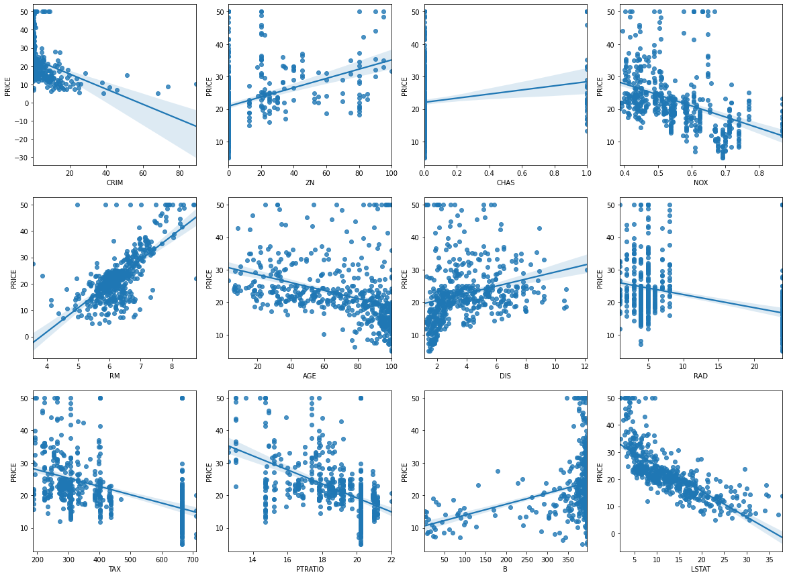
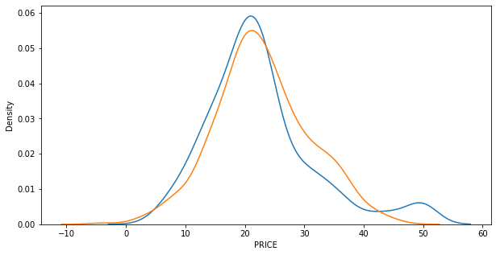
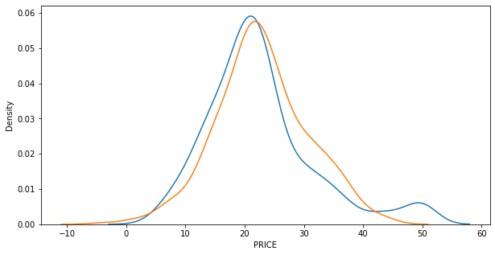

## 선형회귀

사이킷런 보스턴 데이터셋 이용


```python
import numpy as np
import matplotlib.pyplot as plt
import pandas as pd
import seaborn as sns
from scipy import stats
from sklearn.datasets import load_boston
%matplotlib inline
```


```python
boston=load_boston()

boston
```


    {'data': array([[6.3200e-03, 1.8000e+01, 2.3100e+00, ..., 1.5300e+01, 3.9690e+02,
             4.9800e+00],
            [2.7310e-02, 0.0000e+00, 7.0700e+00, ..., 1.7800e+01, 3.9690e+02,
             9.1400e+00],
            [2.7290e-02, 0.0000e+00, 7.0700e+00, ..., 1.7800e+01, 3.9283e+02,
             4.0300e+00],
            ...,
            [6.0760e-02, 0.0000e+00, 1.1930e+01, ..., 2.1000e+01, 3.9690e+02,
             5.6400e+00],
            [1.0959e-01, 0.0000e+00, 1.1930e+01, ..., 2.1000e+01, 3.9345e+02,
             6.4800e+00],
            [4.7410e-02, 0.0000e+00, 1.1930e+01, ..., 2.1000e+01, 3.9690e+02,
             7.8800e+00]]),
     'target': array([24. , 21.6, 34.7, 33.4, 36.2, 28.7, 22.9, 27.1, 16.5, 18.9, 15. ,
            18.9, 21.7, 20.4, 18.2, 19.9, 23.1, 17.5, 20.2, 18.2, 13.6, 19.6,
            15.2, 14.5, 15.6, 13.9, 16.6, 14.8, 18.4, 21. , 12.7, 14.5, 13.2,
            13.1, 13.5, 18.9, 20. , 21. , 24.7, 30.8, 34.9, 26.6, 25.3, 24.7,
            21.2, 19.3, 20. , 16.6, 14.4, 19.4, 19.7, 20.5, 25. , 23.4, 18.9,
            35.4, 24.7, 31.6, 23.3, 19.6, 18.7, 16. , 22.2, 25. , 33. , 23.5,
            19.4, 22. , 17.4, 20.9, 24.2, 21.7, 22.8, 23.4, 24.1, 21.4, 20. ,
            20.8, 21.2, 20.3, 28. , 23.9, 24.8, 22.9, 23.9, 26.6, 22.5, 22.2,
            23.6, 28.7, 22.6, 22. , 22.9, 25. , 20.6, 28.4, 21.4, 38.7, 43.8,
            33.2, 27.5, 26.5, 18.6, 19.3, 20.1, 19.5, 19.5, 20.4, 19.8, 19.4,
            21.7, 22.8, 18.8, 18.7, 18.5, 18.3, 21.2, 19.2, 20.4, 19.3, 22. ,
            20.3, 20.5, 17.3, 18.8, 21.4, 15.7, 16.2, 18. , 14.3, 19.2, 19.6,
            23. , 18.4, 15.6, 18.1, 17.4, 17.1, 13.3, 17.8, 14. , 14.4, 13.4,
            15.6, 11.8, 13.8, 15.6, 14.6, 17.8, 15.4, 21.5, 19.6, 15.3, 19.4,
            17. , 15.6, 13.1, 41.3, 24.3, 23.3, 27. , 50. , 50. , 50. , 22.7,
            25. , 50. , 23.8, 23.8, 22.3, 17.4, 19.1, 23.1, 23.6, 22.6, 29.4,
            23.2, 24.6, 29.9, 37.2, 39.8, 36.2, 37.9, 32.5, 26.4, 29.6, 50. ,
            32. , 29.8, 34.9, 37. , 30.5, 36.4, 31.1, 29.1, 50. , 33.3, 30.3,
            34.6, 34.9, 32.9, 24.1, 42.3, 48.5, 50. , 22.6, 24.4, 22.5, 24.4,
            20. , 21.7, 19.3, 22.4, 28.1, 23.7, 25. , 23.3, 28.7, 21.5, 23. ,
            26.7, 21.7, 27.5, 30.1, 44.8, 50. , 37.6, 31.6, 46.7, 31.5, 24.3,
            31.7, 41.7, 48.3, 29. , 24. , 25.1, 31.5, 23.7, 23.3, 22. , 20.1,
            22.2, 23.7, 17.6, 18.5, 24.3, 20.5, 24.5, 26.2, 24.4, 24.8, 29.6,
            42.8, 21.9, 20.9, 44. , 50. , 36. , 30.1, 33.8, 43.1, 48.8, 31. ,
            36.5, 22.8, 30.7, 50. , 43.5, 20.7, 21.1, 25.2, 24.4, 35.2, 32.4,
            32. , 33.2, 33.1, 29.1, 35.1, 45.4, 35.4, 46. , 50. , 32.2, 22. ,
            20.1, 23.2, 22.3, 24.8, 28.5, 37.3, 27.9, 23.9, 21.7, 28.6, 27.1,
            20.3, 22.5, 29. , 24.8, 22. , 26.4, 33.1, 36.1, 28.4, 33.4, 28.2,
            22.8, 20.3, 16.1, 22.1, 19.4, 21.6, 23.8, 16.2, 17.8, 19.8, 23.1,
            21. , 23.8, 23.1, 20.4, 18.5, 25. , 24.6, 23. , 22.2, 19.3, 22.6,
            19.8, 17.1, 19.4, 22.2, 20.7, 21.1, 19.5, 18.5, 20.6, 19. , 18.7,
            32.7, 16.5, 23.9, 31.2, 17.5, 17.2, 23.1, 24.5, 26.6, 22.9, 24.1,
            18.6, 30.1, 18.2, 20.6, 17.8, 21.7, 22.7, 22.6, 25. , 19.9, 20.8,
            16.8, 21.9, 27.5, 21.9, 23.1, 50. , 50. , 50. , 50. , 50. , 13.8,
            13.8, 15. , 13.9, 13.3, 13.1, 10.2, 10.4, 10.9, 11.3, 12.3,  8.8,
             7.2, 10.5,  7.4, 10.2, 11.5, 15.1, 23.2,  9.7, 13.8, 12.7, 13.1,
            12.5,  8.5,  5. ,  6.3,  5.6,  7.2, 12.1,  8.3,  8.5,  5. , 11.9,
            27.9, 17.2, 27.5, 15. , 17.2, 17.9, 16.3,  7. ,  7.2,  7.5, 10.4,
             8.8,  8.4, 16.7, 14.2, 20.8, 13.4, 11.7,  8.3, 10.2, 10.9, 11. ,
             9.5, 14.5, 14.1, 16.1, 14.3, 11.7, 13.4,  9.6,  8.7,  8.4, 12.8,
            10.5, 17.1, 18.4, 15.4, 10.8, 11.8, 14.9, 12.6, 14.1, 13. , 13.4,
            15.2, 16.1, 17.8, 14.9, 14.1, 12.7, 13.5, 14.9, 20. , 16.4, 17.7,
            19.5, 20.2, 21.4, 19.9, 19. , 19.1, 19.1, 20.1, 19.9, 19.6, 23.2,
            29.8, 13.8, 13.3, 16.7, 12. , 14.6, 21.4, 23. , 23.7, 25. , 21.8,
            20.6, 21.2, 19.1, 20.6, 15.2,  7. ,  8.1, 13.6, 20.1, 21.8, 24.5,
            23.1, 19.7, 18.3, 21.2, 17.5, 16.8, 22.4, 20.6, 23.9, 22. , 11.9]),
     'feature_names': array(['CRIM', 'ZN', 'INDUS', 'CHAS', 'NOX', 'RM', 'AGE', 'DIS', 'RAD',
            'TAX', 'PTRATIO', 'B', 'LSTAT'], dtype='<U7'),
     'DESCR': ".. _boston_dataset:\n\nBoston house prices dataset\n---------------------------\n\n**Data Set Characteristics:**  \n\n    :Number of Instances: 506 \n\n    :Number of Attributes: 13 numeric/categorical predictive. Median Value (attribute 14) is usually the target.\n\n    :Attribute Information (in order):\n        - CRIM     per capita crime rate by town\n        - ZN       proportion of residential land zoned for lots over 25,000 sq.ft.\n        - INDUS    proportion of non-retail business acres per town\n        - CHAS     Charles River dummy variable (= 1 if tract bounds river; 0 otherwise)\n        - NOX      nitric oxides concentration (parts per 10 million)\n        - RM       average number of rooms per dwelling\n        - AGE      proportion of owner-occupied units built prior to 1940\n        - DIS      weighted distances to five Boston employment centres\n        - RAD      index of accessibility to radial highways\n        - TAX      full-value property-tax rate per $10,000\n        - PTRATIO  pupil-teacher ratio by town\n        - B        1000(Bk - 0.63)^2 where Bk is the proportion of blacks by town\n        - LSTAT    % lower status of the population\n        - MEDV     Median value of owner-occupied homes in $1000's\n\n    :Missing Attribute Values: None\n\n    :Creator: Harrison, D. and Rubinfeld, D.L.\n\nThis is a copy of UCI ML housing dataset.\nhttps://archive.ics.uci.edu/ml/machine-learning-databases/housing/\n\n\nThis dataset was taken from the StatLib library which is maintained at Carnegie Mellon University.\n\nThe Boston house-price data of Harrison, D. and Rubinfeld, D.L. 'Hedonic\nprices and the demand for clean air', J. Environ. Economics & Management,\nvol.5, 81-102, 1978.   Used in Belsley, Kuh & Welsch, 'Regression diagnostics\n...', Wiley, 1980.   N.B. Various transformations are used in the table on\npages 244-261 of the latter.\n\nThe Boston house-price data has been used in many machine learning papers that address regression\nproblems.   \n     \n.. topic:: References\n\n   - Belsley, Kuh & Welsch, 'Regression diagnostics: Identifying Influential Data and Sources of Collinearity', Wiley, 1980. 244-261.\n   - Quinlan,R. (1993). Combining Instance-Based and Model-Based Learning. In Proceedings on the Tenth International Conference of Machine Learning, 236-243, University of Massachusetts, Amherst. Morgan Kaufmann.\n",
     'filename': 'C:\\ProgramData\\Anaconda3\\lib\\site-packages\\sklearn\\datasets\\data\\boston_house_prices.csv'}


```python
df=pd.DataFrame(boston.data,columns=boston.feature_names)

df.head()
```


<div>
<style scoped>
    .dataframe tbody tr th:only-of-type {
        vertical-align: middle;
    }

    .dataframe tbody tr th {
        vertical-align: top;
    }

    .dataframe thead th {
        text-align: right;
    }
</style>
<table border="1" class="dataframe">
  <thead>
    <tr style="text-align: right;">
      <th></th>
      <th>CRIM</th>
      <th>ZN</th>
      <th>INDUS</th>
      <th>CHAS</th>
      <th>NOX</th>
      <th>RM</th>
      <th>AGE</th>
      <th>DIS</th>
      <th>RAD</th>
      <th>TAX</th>
      <th>PTRATIO</th>
      <th>B</th>
      <th>LSTAT</th>
    </tr>
  </thead>
  <tbody>
    <tr>
      <th>0</th>
      <td>0.00632</td>
      <td>18.0</td>
      <td>2.31</td>
      <td>0.0</td>
      <td>0.538</td>
      <td>6.575</td>
      <td>65.2</td>
      <td>4.0900</td>
      <td>1.0</td>
      <td>296.0</td>
      <td>15.3</td>
      <td>396.90</td>
      <td>4.98</td>
    </tr>
    <tr>
      <th>1</th>
      <td>0.02731</td>
      <td>0.0</td>
      <td>7.07</td>
      <td>0.0</td>
      <td>0.469</td>
      <td>6.421</td>
      <td>78.9</td>
      <td>4.9671</td>
      <td>2.0</td>
      <td>242.0</td>
      <td>17.8</td>
      <td>396.90</td>
      <td>9.14</td>
    </tr>
    <tr>
      <th>2</th>
      <td>0.02729</td>
      <td>0.0</td>
      <td>7.07</td>
      <td>0.0</td>
      <td>0.469</td>
      <td>7.185</td>
      <td>61.1</td>
      <td>4.9671</td>
      <td>2.0</td>
      <td>242.0</td>
      <td>17.8</td>
      <td>392.83</td>
      <td>4.03</td>
    </tr>
    <tr>
      <th>3</th>
      <td>0.03237</td>
      <td>0.0</td>
      <td>2.18</td>
      <td>0.0</td>
      <td>0.458</td>
      <td>6.998</td>
      <td>45.8</td>
      <td>6.0622</td>
      <td>3.0</td>
      <td>222.0</td>
      <td>18.7</td>
      <td>394.63</td>
      <td>2.94</td>
    </tr>
    <tr>
      <th>4</th>
      <td>0.06905</td>
      <td>0.0</td>
      <td>2.18</td>
      <td>0.0</td>
      <td>0.458</td>
      <td>7.147</td>
      <td>54.2</td>
      <td>6.0622</td>
      <td>3.0</td>
      <td>222.0</td>
      <td>18.7</td>
      <td>396.90</td>
      <td>5.33</td>
    </tr>
  </tbody>
</table>
</div>


```python
df['PRICE']=boston.target

print(df.shape)
print('\n')
print(df.head())
```

    (506, 14)
    
    
          CRIM    ZN  INDUS  CHAS    NOX     RM   AGE     DIS  RAD    TAX  \
    0  0.00632  18.0   2.31   0.0  0.538  6.575  65.2  4.0900  1.0  296.0   
    1  0.02731   0.0   7.07   0.0  0.469  6.421  78.9  4.9671  2.0  242.0   
    2  0.02729   0.0   7.07   0.0  0.469  7.185  61.1  4.9671  2.0  242.0   
    3  0.03237   0.0   2.18   0.0  0.458  6.998  45.8  6.0622  3.0  222.0   
    4  0.06905   0.0   2.18   0.0  0.458  7.147  54.2  6.0622  3.0  222.0   
    
       PTRATIO       B  LSTAT  PRICE  
    0     15.3  396.90   4.98   24.0  
    1     17.8  396.90   9.14   21.6  
    2     17.8  392.83   4.03   34.7  
    3     18.7  394.63   2.94   33.4  
    4     18.7  396.90   5.33   36.2  
    

PRICE가 내가 예측할 값


```python
df.info()
```

    <class 'pandas.core.frame.DataFrame'>
    RangeIndex: 506 entries, 0 to 505
    Data columns (total 14 columns):
     #   Column   Non-Null Count  Dtype  
    ---  ------   --------------  -----  
     0   CRIM     506 non-null    float64
     1   ZN       506 non-null    float64
     2   INDUS    506 non-null    float64
     3   CHAS     506 non-null    float64
     4   NOX      506 non-null    float64
     5   RM       506 non-null    float64
     6   AGE      506 non-null    float64
     7   DIS      506 non-null    float64
     8   RAD      506 non-null    float64
     9   TAX      506 non-null    float64
     10  PTRATIO  506 non-null    float64
     11  B        506 non-null    float64
     12  LSTAT    506 non-null    float64
     13  PRICE    506 non-null    float64
    dtypes: float64(14)
    memory usage: 55.5 KB
    

각 컬럼이 주택가격에 미치는 영향도


```python
fig,axs=plt.subplots(figsize=(20,15),ncols=4,nrows=3)
feat=['CRIM','ZN','CHAS','NOX','RM','AGE','DIS','RAD','TAX',
     'PTRATIO','B','LSTAT'] #실행했을 때 에러난 거는 뺐음

for i,feature in enumerate(feat):
    row=int(i/4)
    col=i%4
    sns.regplot(x=feature,y='PRICE',data=df,ax=axs[row][col]) #regplot =>회귀직선 그려줌

```


    

    


RM(방 개수),LSTAT(하위계층 비율)이 PRICE 영향도가 뚜렷한 편

  

학습과 테스트 데이터 세트로 분리하고 학습/예측/평가 수행


```python
from sklearn.model_selection import train_test_split
from sklearn.linear_model import LinearRegression
from sklearn.metrics import mean_squared_error,r2_score

y_target=df['PRICE'] #피쳐 데이터셋
X_data=df.drop(['PRICE'],axis=1,inplace=False)

X_train,X_test,y_train,y_test=train_test_split(X_data,y_target,test_size=0.3,
                                              random_state=156)

lr=LinearRegression()
lr.fit(X_train,y_train)
y_preds=lr.predict(X_test)
mse=mean_squared_error(y_test,y_preds)
rmse=np.sqrt(mse)

print('MSE :',mse,'RMSE :',rmse)
print('var score : ',r2_score(y_test,y_preds))
```

    MSE : 17.29691590790215 RMSE : 4.158956107955715
    var score :  0.7572263323138921
    

mse 작을수록 좋은 회귀모델


```python
print(lr.intercept_) #절편
print(np.round(lr.coef_,1)) #각각 회귀계수
```

    40.995595172164336
    [ -0.1   0.1   0.    3.  -19.8   3.4   0.   -1.7   0.4  -0.   -0.9   0.
      -0.6]
    

피처별 회귀계수


```python
coeff = pd.Series(data=np.round(lr.coef_, 1), index=X_data.columns )
coeff
```


    CRIM       -0.1
    ZN          0.1
    INDUS       0.0
    CHAS        3.0
    NOX       -19.8
    RM          3.4
    AGE         0.0
    DIS        -1.7
    RAD         0.4
    TAX        -0.0
    PTRATIO    -0.9
    B           0.0
    LSTAT      -0.6
    dtype: float64


   


```python
#실제 값 비교

y_hat=lr.predict(X_data)

plt.figure(figsize=(10,5))
ax1=sns.distplot(y_target,hist=False,label="y")
ax2=sns.distplot(y_hat,hist=False,label="y_hat",ax=ax1)
plt.show()
```

    C:\ProgramData\Anaconda3\lib\site-packages\seaborn\distributions.py:2551: FutureWarning: `distplot` is a deprecated function and will be removed in a future version. Please adapt your code to use either `displot` (a figure-level function with similar flexibility) or `kdeplot` (an axes-level function for kernel density plots).
      warnings.warn(msg, FutureWarning)
    C:\ProgramData\Anaconda3\lib\site-packages\seaborn\distributions.py:2551: FutureWarning: `distplot` is a deprecated function and will be removed in a future version. Please adapt your code to use either `displot` (a figure-level function with similar flexibility) or `kdeplot` (an axes-level function for kernel density plots).
      warnings.warn(msg, FutureWarning)
    


    

    


```python
from sklearn.linear_model import Ridge

rid=Ridge(alpha=10)
rid.fit(X_train,y_train)
y_preds=rid.predict(X_test)
mse=mean_squared_error(y_test,y_preds)
rmse=np.sqrt(mse)

print('MSE :',mse,'RMSE :',rmse)
print('var score : ',r2_score(y_test,y_preds))

```

    MSE : 17.69867986821103 RMSE : 4.206979898717253
    var score :  0.7515873091083898
    


```python
rid=Ridge(alpha=0.1)
rid.fit(X_train,y_train)
y_preds=rid.predict(X_test)
mse=mean_squared_error(y_test,y_preds)
rmse=np.sqrt(mse)

print('MSE :',mse,'RMSE :',rmse)
print('var score : ',r2_score(y_test,y_preds))
```

    MSE : 17.244292672297743 RMSE : 4.152624793103483
    var score :  0.7579649342693631
    


```python
#실제 값 비교

y_hat=rid.predict(X_data)

plt.figure(figsize=(10,5))
ax1=sns.distplot(y_target,hist=False,label="y")
ax2=sns.distplot(y_hat,hist=False,label="y_hat",ax=ax1)
plt.show()
```

    C:\ProgramData\Anaconda3\lib\site-packages\seaborn\distributions.py:2551: FutureWarning: `distplot` is a deprecated function and will be removed in a future version. Please adapt your code to use either `displot` (a figure-level function with similar flexibility) or `kdeplot` (an axes-level function for kernel density plots).
      warnings.warn(msg, FutureWarning)
    C:\ProgramData\Anaconda3\lib\site-packages\seaborn\distributions.py:2551: FutureWarning: `distplot` is a deprecated function and will be removed in a future version. Please adapt your code to use either `displot` (a figure-level function with similar flexibility) or `kdeplot` (an axes-level function for kernel density plots).
      warnings.warn(msg, FutureWarning)
    


    

    


## 다항회귀

위의 데이터 똑같이 이용


```python
from sklearn.model_selection import train_test_split
from sklearn.linear_model import LinearRegression
from sklearn.metrics import mean_squared_error,r2_score
from sklearn.preprocessing import PolynomialFeatures
from sklearn.pipeline import Pipeline


#pipeline 이용해 poly와 linear 결합
pipe=Pipeline([('poly',PolynomialFeatures(degree=3,include_bias=False)),
              ('linear',LinearRegression())])
po=pipe.fit(X_train,y_train)
y_preds=pipe.predict(X_test)
mse=mean_squared_error(y_test,y_preds)
rmse=np.sqrt(mse)

print('MSE :',mse,'RMSE :',rmse)
print('var score : ',r2_score(y_test,y_preds))
```

    MSE : 79625.59338079175 RMSE : 282.1800726146192
    var score :  -1116.5979261080904
    


```python
np.round(po.named_steps['linear'].coef_, 2)
```


    array([ 0.01,  0.03,  0.05, -0.  ,  0.  ,  0.  ,  0.18, -0.05,  0.03,
            1.34, -0.05,  0.07,  0.01,  0.05,  0.2 , -0.13, -0.  , -0.09,
            0.13, -1.2 ,  0.12,  0.02,  1.57,  0.1 , -1.37, -1.03,  0.64,
            0.  , -0.  ,  0.06,  0.78,  0.1 , -1.79, -0.66,  0.37, -2.63,
           -0.06,  0.6 ,  0.2 , -0.  , -0.01, -0.56, -6.2 ,  0.24,  0.23,
            1.47,  0.36,  0.05,  0.93, -0.  , -0.  , -0.  , -0.01, -0.  ,
           -0.  , -0.07, -0.  , -0.07,  0.  , -0.  , -0.04,  0.09, -0.08,
           -0.  ,  0.14,  0.02, -1.13,  0.18,  0.88, -0.34, -0.52, -0.15,
           -0.53,  0.  ,  0.67, -3.55,  0.02,  4.04, -3.97,  0.5 , -3.06,
           -0.08, -0.36,  0.59,  0.13, -1.32, -0.55,  0.47,  4.41, -0.27,
            1.31,  0.31,  0.13, -1.05, -0.13,  1.12,  0.02, -0.14, -0.69,
           -0.15,  1.52, -0.  ,  0.09, -1.77, -0.  , -0.14,  0.22, -0.01,
           -3.05,  0.18, -0.  ,  0.09,  0.07,  0.04, -1.54, -0.  ,  0.  ,
            0.45,  1.07,  0.  ,  0.02,  1.69,  0.39, -3.33, -1.42, -0.3 ,
            2.17,  0.16, -2.08, -3.85, -0.01, -2.22, -1.5 ,  1.87, -1.82,
           -0.74,  0.31, -2.97, -0.13, -2.2 , -0.  , -0.  ,  0.  , -0.03,
            0.  ,  0.01, -0.02,  0.  ,  0.03, -0.05,  0.33, -3.02,  4.17,
           -1.1 ,  2.23, -0.57, -0.6 ,  0.1 ,  2.35, -1.56, -0.02, -0.87,
            1.03,  0.04,  0.44, -0.02, -0.66, -0.01,  0.22,  2.07, -0.16,
            1.27, -0.  ,  0.03,  7.  ,  2.6 , -0.11, -0.05, -0.01,  0.1 ,
           -0.51, -0.08, -1.06, -0.15, -1.9 , -0.  ,  0.08,  0.01,  0.16,
           -0.29, -0.1 , -1.1 , -0.  , -0.  , -0.03,  0.  ,  0.03,  0.11,
            1.47, -0.09, -0.  ,  0.03,  0.01, -0.  , -0.03,  0.  ,  0.01,
           -0.08,  0.01,  0.35, -2.71, -0.02, -0.41,  0.19, -0.01,  0.25,
            0.05, -0.05, -0.  , -0.  ,  0.01,  0.27,  0.01, -0.  ,  0.14,
            0.01, -0.13,  0.05,  0.01, -0.23,  0.18, -0.01, -0.43, -1.51,
            2.04,  0.73,  6.68,  0.16, -0.07, -0.24,  1.94,  0.01, -0.06,
            0.01, -0.31, -0.01, -0.03, -0.  ,  0.  , -0.03,  0.  ,  0.01,
           -0.75,  0.09, -0.  , -0.01,  0.04,  0.13,  0.17,  0.02,  0.67,
           -0.09,  0.29,  0.  , -0.02,  0.  ,  0.  , -0.21,  0.04, -0.12,
           -0.  , -0.01, -0.05, -0.13, -0.03, -0.18,  0.32,  0.06, -0.03,
            0.12,  0.02,  1.35, -0.08,  0.13, -0.  ,  0.  ,  0.02,  0.09,
            0.01,  0.  , -0.  ,  0.01, -0.02,  0.05, -0.02, -2.25,  3.48,
            0.27,  0.19, -1.3 , -0.34,  0.23,  0.72, -0.33,  0.13, -0.51,
            1.11,  0.04, -1.45,  0.02, -1.12, -0.01,  0.22,  0.01, -0.  ,
           -0.07,  0.01,  0.03, -0.44, -0.76, -0.05, -1.71,  0.1 ,  0.35,
           -0.5 ,  0.13,  0.85, -0.16,  0.29, -0.  , -0.15,  0.01, -0.  ,
            2.02, -0.08, -0.47, -0.  ,  0.02, -0.03, -0.  , -0.  , -0.  ,
           -0.01, -0.  , -0.  , -0.07, -0.  , -0.07,  0.  ,  0.  ,  0.  ,
            0.  , -0.  ,  0.  ,  0.03,  0.  , -0.03, -0.  ,  0.01,  0.1 ,
           -0.01, -0.03, -0.06, -0.01,  0.02, -0.01, -0.06,  0.06, -0.13,
            0.01,  0.18,  0.01, -0.03, -0.01, -0.  ,  0.04, -0.01, -0.21,
            0.03,  0.01,  0.05, -0.03, -0.04, -0.03,  0.  , -0.17,  0.  ,
            0.02,  0.01,  0.18,  0.14, -0.  , -0.02,  0.06,  0.02,  0.07,
            4.3 , -0.19, -0.02, -0.66,  0.  ,  3.41,  0.3 ,  1.4 ,  1.57,
           -0.51,  1.51, -0.94,  0.24,  1.4 ,  1.79,  0.09, -0.57, -0.22,
           -0.17, -0.37, -0.  ,  0.43, -0.27,  0.62,  0.46, -1.  ,  0.02,
           -1.4 ,  0.08, -0.64,  0.07,  0.74, -0.95,  0.07,  0.13, -0.04,
           -0.17,  0.47, -0.46,  4.72, -0.  , -0.06, -0.55,  1.57, -0.02,
           -1.9 , -3.05,  0.19, -0.04, -0.15, -0.28,  0.01,  0.34,  0.3 ,
           -0.02,  0.07, -0.  , -0.04,  0.81, -0.63,  0.09, -3.96,  0.14,
            0.38,  2.03, -0.15,  0.73,  0.07, -1.09, -0.  ,  0.12, -0.  ,
            0.1 , -0.98,  0.05, -0.95, -0.  ,  0.01,  0.22,  0.  ,  0.02,
            0.  ,  0.  , -0.01, -0.  ,  0.  ,  0.32,  0.03, -0.01, -0.14,
           -0.02, -0.06, -0.02,  0.  ,  0.07, -0.  , -0.  , -0.  , -0.  ,
           -0.  , -0.  ,  0.06,  0.01,  0.04,  0.  ,  0.  , -0.01,  1.01,
            0.8 , -0.12,  0.96, -0.06, -0.39,  0.21,  0.02, -0.1 , -0.01,
           -0.4 ,  0.  ,  0.15, -0.  ,  0.01,  0.15, -0.  , -0.83, -0.  ,
            0.03,  0.12, -0.14,  0.02, -2.35,  0.05,  0.53, -0.  ,  0.03,
            0.  , -0.05, -0.27, -0.  ,  0.57, -0.  ,  0.02, -0.08,  0.  ,
            0.01, -0.  ,  0.  , -0.15,  0.  ,  0.01,  0.  , -0.  ,  0.01,
            0.7 , -0.02,  0.01,  0.  , -0.  , -0.07, -0.  ,  0.  ,  0.  ,
            0.02])


